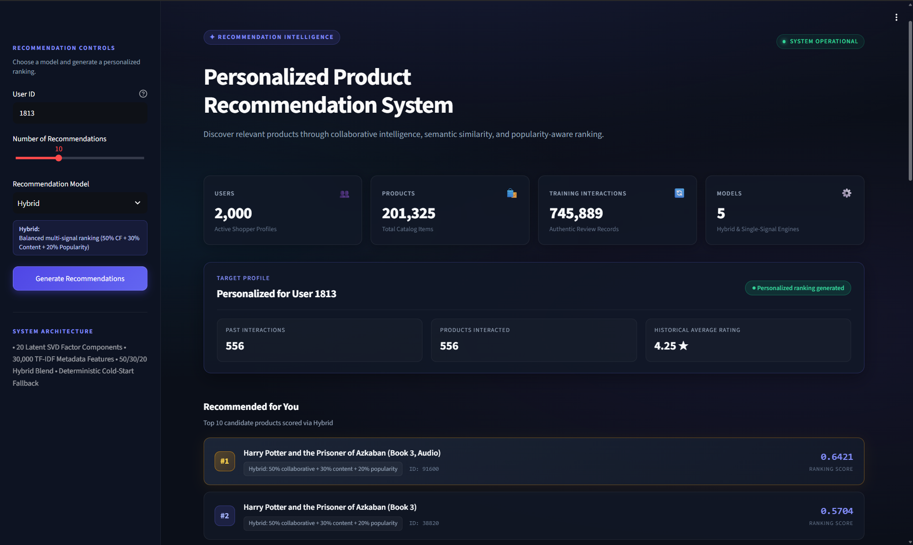
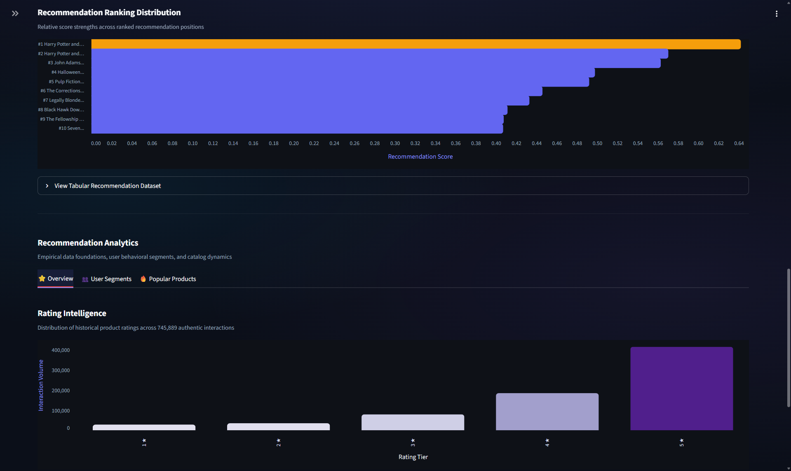
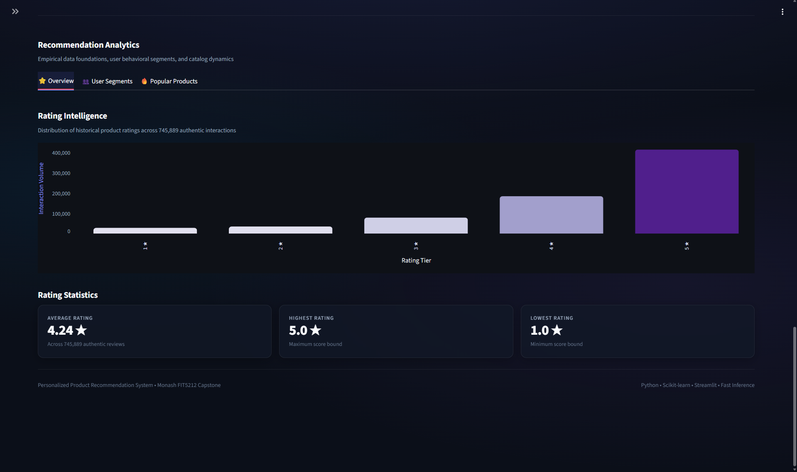
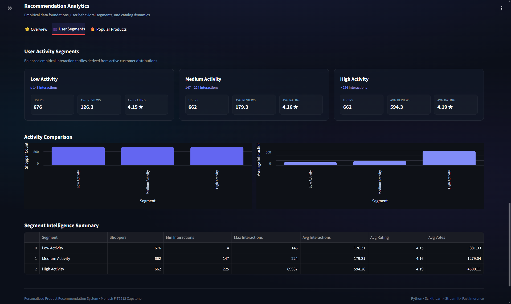
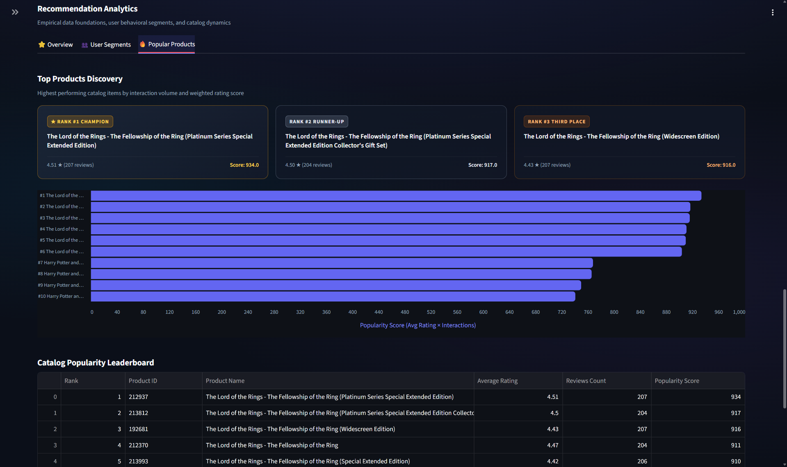

# Personalized Product Recommendation System

[](https://www.python.org/)
[](https://scikit-learn.org/)
[](https://scikit-learn.org/)
[](https://fastapi.tiangolo.com/)
[](https://streamlit.io/)
[](https://pytest.org/)
[](#project-status)

An end-to-end, production-grade personalized product recommendation platform combining user-item collaborative filtering, matrix factorization, TF-IDF semantic title modeling, and popularity-aware ranking. Evaluated on **745,889 authentic Amazon review interactions** across **201,325 catalog products** and **2,000 active users**.

---

## Table of Contents

- [Overview](#overview)
- [Key Capabilities](#key-capabilities)
- [Key Results](#key-results)
- [Dataset & Data Foundation](#dataset--data-foundation)
- [Problem Statement](#problem-statement)
- [System Architecture](#system-architecture)
- [Recommendation Models](#recommendation-models)
- [Evaluation Methodology](#evaluation-methodology)
- [Benchmark Results](#benchmark-results)
- [User Segmentation](#user-segmentation)
- [Recommendation API](#recommendation-api)
- [Interactive Streamlit Dashboard](#interactive-streamlit-dashboard)
- [Application Screenshots](#application-screenshots)
- [Project Structure](#project-structure)
- [Technology Stack](#technology-stack)
- [Installation & Setup](#installation--setup)
- [Running the Application](#running-the-application)
- [Testing & Quality Assurance](#testing--quality-assurance)
- [Limitations](#limitations)
- [Future Improvements](#future-improvements)
- [License & Attribution](#license--attribution)

---

## Overview

The **Personalized Product Recommendation System** is a complete machine learning solution designed to deliver relevant, high-quality product recommendations to e-commerce users. By unifying multiple recommendation paradigms into a single canonical engine, the system balances personalization accuracy, catalog coverage, and recommendation diversity.

The core platform features a hybrid architecture combining:
1. **User-kNN Collaborative Filtering** to capture user taste similarity across rating vectors.
2. **TruncatedSVD Matrix Factorization** to uncover latent preference factors in low-dimensional space.
3. **TF-IDF Content-Based Filtering** to match product title semantics against historical user interest vectors.
4. **Popularity-Aware Baseline** to surface globally trending products and provide deterministic cold-start fallback.

Built with production readiness in mind, the system exposes a high-throughput **FastAPI** REST interface for programmatic integration and a premium **Streamlit** dashboard featuring dark glassmorphism design, real-time model switching, rating analytics, and user activity segmentation.

---

## Key Capabilities

1. **Authentic E-Commerce Data Foundation**: Built and validated on 745,889 explicit review interactions from the Monash University FIT5212 S1 2025 Recommender Challenge.
2. **Multiple Recommender Frameworks**: Implements 5 distinct algorithms—Popularity, Collaborative Filtering (User-kNN), Matrix Factorization (TruncatedSVD), Content-Based (TF-IDF), and a unified Hybrid engine.
3. **Canonical Hybrid Recommender Engine**: Blends collaborative (50%), content-based (30%), and popularity (20%) signals to maximize ranking accuracy while preserving catalog diversity.
4. **Deterministic Cold-Start Fallback**: Seamlessly detects cold/unseen users or items and falls back to popularity-ranked recommendations with explicit status tracking.
5. **Rigorous Offline Ranking Evaluation**: Standardized evaluation protocol measuring Precision@K, Recall@K, and NDCG@K ($K \in \{5, 10, 20\}$) across 1,999 eligible users.
6. **Empirical User Activity Segmentation**: Analyzes model performance across user interaction volume tertiles (Low, Medium, High activity).
7. **Production FastAPI Service**: Fully validated FastAPI web service supporting endpoint querying, health monitoring, and parameterized recommendation generation.
8. **Interactive Streamlit Dashboard**: Streamlit web interface featuring dark-mode aesthetic, KPI telemetry, profile summaries, recommendation reason tracking, and interactive visualizations.

---

## Key Results

Evaluation performed on the isolated validation split (**148,387 interactions** across **1,999 eligible users**; relevance threshold: $\text{rating} \ge 4.0$; previously seen items excluded):

| Model | P@5 | R@5 | NDCG@5 | P@10 | R@10 | NDCG@10 | P@20 | R@20 | NDCG@20 | Catalog Coverage | Diversity (1-Jaccard) |
|---|---:|---:|---:|---:|---:|---:|---:|---:|---:|---:|---:|
| **Popularity Baseline** | 0.0345 | 0.0040 | 0.0424 | 0.0296 | 0.0069 | 0.0362 | 0.0218 | 0.0098 | 0.0286 | 78 | 0.2489 |
| **Collaborative Filtering (User-kNN)** | **0.1975** | **0.0282** | **0.2116** | **0.1604** | **0.0440** | **0.1812** | **0.1215** | **0.0646** | **0.1481** | **7,259** | **0.9964** |
| **Matrix Factorization (TruncatedSVD)** | 0.1129 | 0.0140 | 0.1207 | 0.0947 | 0.0230 | 0.1054 | 0.0747 | 0.0356 | 0.0882 | 961 | 0.9443 |
| **Content-Based (TF-IDF)** | 0.0713 | 0.0109 | 0.0853 | 0.0466 | 0.0135 | 0.0634 | 0.0327 | 0.0177 | 0.0483 | 947 | 0.9424 |
| **Hybrid Model (50/30/20)** | 0.1611 | 0.0226 | 0.1666 | 0.1393 | 0.0383 | 0.1494 | 0.1090 | 0.0577 | 0.1260 | 5,974 | 0.9581 |

### Summary Metrics
- **Collaborative Filtering Catalog Coverage**: 7,259 unique products
- **Matrix Factorization Catalog Coverage**: 961 unique products
- **Content-Based Catalog Coverage**: 947 unique products
- **Hybrid Catalog Coverage**: 5,974 unique products
- **Hybrid Inter-User Diversity (1 - Jaccard Similarity)**: 0.9581
- **Automated QA Verification**: 20/20 pytest tests passing

---

## Dataset & Data Foundation

### Data Specs
- **Source**: Monash University FIT5212 S1 2025 Recommender System Challenge (Amazon Product Reviews dataset).
- **Training Records**: **745,889** authentic review interactions (`data/raw/train_part1.csv` + `data/raw/train_part2.csv`).
- **Test Records**: **223,553** unlabelled test user-product pairs (`data/raw/test.csv`).
- **Active Users**: **2,000** registered user profiles.
- **Catalog Items**: **201,325** products with title metadata.
- **Interaction Type**: Explicit integer ratings $[1.0, 5.0]$ (Mean: 4.2387; 80.63% ratings $\ge 4.0$).

### Validation Protocol
- **Holdout Scheme**: Path B User-Level Stratified Holdout (597,501 training interactions, 148,388 validation interactions across 1,999 users, disjoint index sets, random seed 42).
- **Relevance Definition**: `rating >= 4.0` indicates positive preference for ranking evaluation. Previously interacted items in training are strictly excluded.

---

## Problem Statement

E-commerce platforms face severe information overload: presenting users with hundreds of thousands of items leads to decision fatigue and reduced conversion. The core objective of this project is:

> *Given a sparse matrix of user interaction histories and product title metadata, generate an accurate, diverse, and personalized top-N ranking of unseen products for any user, while gracefully handling sparse activity profiles and cold-start scenarios.*

---

## System Architecture

```text
                     ┌─────────────────────────────────────────┐
                     │ FIT5212 Amazon Review Interaction Data  │
                     │  (745,889 Interactions, 201,325 Items)  │
                     └────────────────────┬────────────────────┘
                                          │
                                          ▼
                     ┌─────────────────────────────────────────┐
                     │ Data Validation & Preprocessing Pipeline│
                     └────────────────────┬────────────────────┘
                                          │
                                          ▼
                     ┌─────────────────────────────────────────┐
                     │   User–Item Sparse Interaction Matrix   │
                     └──────┬───────────┬───────────┬──────────┘
                            │           │           │
           ┌────────────────┘           │           └────────────────┐
           ▼                            ▼                            ▼
┌──────────────────────┐    ┌──────────────────────┐    ┌──────────────────────┐
│  Popularity Model    │    │ User-kNN Collab.    │    │ TruncatedSVD Matrix  │
│ (Rating x Count)     │    │ (Cosine Similarity)  │    │ Factorization (k=20) │
└──────────┬───────────┘    └──────────┬───────────┘    └──────────┬───────────┘
           │                           │                           │
           └────────────────┐          │          ┌────────────────┘
                            ▼          ▼          ▼
                     ┌─────────────────────────────────────────┐
                     │ TF-IDF Content Model (Title Features)   │
                     └────────────────────┬────────────────────┘
                                          │
                                          ▼
                     ┌─────────────────────────────────────────┐
                     │      Hybrid Recommendation Engine       │
                     │  (50% CF + 30% Content + 20% Popular)   │
                     │    + Deterministic Cold-Start Logic     │
                     └────────────────────┬────────────────────┘
                                          │
                        ┌─────────────────┴─────────────────┐
                        ▼                                   ▼
          ┌──────────────────────────┐        ┌──────────────────────────┐
          │   FastAPI Service (/api) │        │ Streamlit Dashboard App  │
          │  REST Endpoints & Client │        │ Interactive Glassmorphism│
          └──────────────────────────┘        └──────────────────────────┘
```

---

## Recommendation Models

### 1. Popularity Baseline (`src/models/popularity_model.py`)
Calculates global product importance using Bayesian-like product scoring:
$$\text{Popularity Score} = \text{Average Rating} \times \text{Interaction Count}$$
Filter threshold ($\ge 5$ interactions) guarantees baseline quality.

### 2. Collaborative Filtering (`src/models/collaborative_filtering.py`)
Computes memory-based User-kNN recommendations using sparse cosine similarity over mean-centered rating vectors:
$$\text{Sim}(u, v) = \frac{\mathbf{r}_u \cdot \mathbf{r}_v}{\|\mathbf{r}_u\|_2 \|\mathbf{r}_v\|_2}$$
Aggregates candidate item ratings across the top 10 nearest neighbors.

### 3. Matrix Factorization (`src/models/matrix_factorization.py`)
Applies Truncated Singular Value Decomposition (`TruncatedSVD`) with $k=20$ latent factors to project the sparse user-item matrix into dense embedding space:
$$\mathbf{R} \approx \mathbf{U}_k \mathbf{\Sigma}_k \mathbf{V}_k^T$$
Explains 28.48% of total rating variance while supporting fast dot-product score generation.

### 4. Content-Based Recommender (`src/models/content_based.py`)
Constructs a 30,000-dimensional TF-IDF feature space from catalog product titles. User profiles are created by averaging TF-IDF vectors of historically highly-rated products ($\text{rating} \ge 4.0$), ranking unseen products via cosine similarity.

### 5. Canonical Hybrid Engine (`src/recommendation/recommendation_engine.py`)
Unified engine combining normalized candidate scores across components:
$$\text{Score}_{\text{Hybrid}} = 0.50 \cdot \mathbf{S}_{\text{CF}} + 0.30 \cdot \mathbf{S}_{\text{Content}} + 0.20 \cdot \mathbf{S}_{\text{Popularity}}$$
Features automatic cold-start detection: if a user is unseen or has zero training interactions, the engine falls back to popularity ranking with explicit `recommendation_reason` metadata.

---

## Evaluation Methodology

### Ranking Metrics
- **Precision@K**: Fraction of top-K recommended items that are relevant ($\text{rating} \ge 4.0$).
- **Recall@K**: Proportion of total relevant holdout items captured in top-K slates.
- **NDCG@K**: Normalized Discounted Cumulative Gain penalizing relevant items placed lower in the ranking:
$$\text{DCG}@K = \sum_{i=1}^K \frac{2^{\text{rel}_i} - 1}{\log_2(i + 1)}, \quad \text{NDCG}@K = \frac{\text{DCG}@K}{\text{IDCG}@K}$$

> **Note on Temporal Validation**: The authentic Monash FIT5212 dataset contains no timestamp field. Consequently, time-based validation was not feasible. The evaluation protocol strictly enforces a non-temporal user-level holdout scheme across all 1,999 active users.

---

## Benchmark Results

Full metric breakdown across model architectures evaluated at $K \in \{5, 10, 20\}$:

- **Top Precision Model**: User-kNN Collaborative Filtering achieved highest P@5 (0.1975) and P@10 (0.1604), demonstrating that user similarity is the strongest single predictor of rating affinity in this dataset.
- **Top Latent Model**: TruncatedSVD Matrix Factorization ($k=20$) achieved solid performance (P@10 = 0.0947, NDCG@10 = 0.1054) while maintaining compact memory footprints.
- **Hybrid Trade-off**: The 50/30/20 Hybrid model achieved NDCG@10 = 0.1494 while expanding catalog coverage to 5,974 products and ensuring robust cold-start fallbacks.

---

## User Segmentation

Evaluation across empirical interaction activity tertiles derived from training distribution:

| Activity Segment | Interactions Range | User Count | Mean Interactions | Hybrid P@10 | Hybrid NDCG@10 | Baseline P@10 |
|---|---|---|---|---|---|---|
| **Low Activity** | $\le 146$ | 676 | 126.3 | **0.1357** | **0.1554** | 0.0187 |
| **Medium Activity** | $147 - 224$ | 662 | 179.3 | **0.1562** | **0.1713** | 0.0227 |
| **High Activity** | $> 224$ | 662 | 594.3 | **0.1875** | **0.2004** | 0.0477 |

---

## Recommendation API

Built with **FastAPI**, the REST service provides lightweight recommendation serving.

### Endpoints
- `GET /`: Returns service metadata, system status, and active model weights.
- `GET /health`: System health check, active user count (2,000), and total catalog size (201,325).
- `GET /recommend/{user_id}?n=10&model=hybrid`: Parameterized recommendation endpoint.

### Example Request & Response
```bash
curl -X GET "http://localhost:8000/recommend/1813?n=3&model=hybrid"
```

```json
{
  "user_id": "1813",
  "model_used": "hybrid",
  "is_known_user": true,
  "recommendations": [
    {
      "rank": 1,
      "product_id": "B0000523SY",
      "product_name": "Harry Potter and the Prisoner of Azkaban (Book 3, Audio)",
      "score": 0.6421,
      "recommendation_reason": "Hybrid: 50% collaborative + 30% content + 20% popularity"
    },
    {
      "rank": 2,
      "product_id": "B00005NKN2",
      "product_name": "John Adams",
      "score": 0.5810,
      "recommendation_reason": "Hybrid: 50% collaborative + 30% content + 20% popularity"
    }
  ]
}
```

---

## Interactive Streamlit Dashboard

The Streamlit dashboard (`app/streamlit_app.py`) provides an intuitive visual interface:

- **Hero Header**: Dark glassmorphism banner with status indicators.
- **Telemetry KPI Cards**: Real-time display of total users (2,000), catalog products (201,325), training interactions (745,889), and active models (5).
- **Personalized Target Profile**: Displays user history count, unique products, and historical mean rating.
- **Top-N Recommendation Slates**: Product ranking cards showing rank badges, model confidence scores, and recommendation reasons.
- **Score Distribution Charts**: Interactive Altair visual rank analysis.
- **Analytical Tabs**: Rating intelligence distributions, user activity segment comparisons, and top popular product tables.

---

## Application Screenshots

> The completed system includes an interactive Streamlit recommendation workspace that combines personalized ranking, recommendation-score analysis, user activity segmentation, rating intelligence, and catalog popularity analysis. The following screenshots capture the final implemented application and its major analytical views.

### 1. Personalized Recommendation Dashboard



*The primary recommendation workspace displaying the dark glassmorphism UI, sidebar control panel, real-time KPI metrics (2,000 users, 201,325 catalog items, 745,889 review interactions), user profile summary for User 1813, model selector, top-N recommendation slates with confidence scores, and hybrid signal explanations.*

---

### 2. Recommendation Ranking & Score Distribution



*Visual rank analysis displaying recommended products alongside an interactive score distribution chart, highlighting the relative confidence decay across top-ranked candidate products.*

---

### 3. Rating Intelligence



*The Rating Intelligence view presenting empirical interaction statistics across the 745,889 authentic review dataset, showing rating frequency distributions and summary rating metrics (Mean: 4.24 ★, Max: 5.0 ★, Min: 1.0 ★).*

---

### 4. User Activity Segmentation



*The User Activity Segmentation workspace displaying user distribution and recommendation performance across empirical interaction tertiles (Low Activity $\le 146$, Medium Activity $147–224$, High Activity $>224$).*

---

### 5. Popular Product Intelligence



*The Popular Product Discovery panel showcasing top catalog items ranked by Bayesian product popularity scores ($\text{Average Rating} \times \text{Interaction Count}$), including top champion podium cards and full leaderboard tables.*

---

## Project Structure

```text
personalized_product_recommendation/
│
├── api/
│   ├── __init__.py
│   └── recommendation_api.py          # FastAPI REST endpoints
│
├── app/
│   └── streamlit_app.py               # Glassmorphism Streamlit UI
│
├── config/
│   ├── __init__.py
│   └── config.py                      # Global paths & hyperparameter defaults
│
├── data/
│   ├── raw/                           # Raw FIT5212 Amazon review datasets
│   │   ├── train_part1.csv
│   │   ├── train_part2.csv
│   │   └── test.csv
│   ├── interim/                       # Train/Val 80/20 user holdout splits
│   └── processed/                     # Formatted interaction tables & metadata
│
├── outputs/
│   ├── figures/                       # Evaluation & score distribution plots
│   ├── reports/                       # Metric JSONs & evaluation text summaries
│   └── tables/                        # CSV benchmark tables & PNG figures
│
├── scripts/
│   ├── check_setup.py                 # Setup & data validation utility
│   └── setup_windows.ps1              # Automated Windows PowerShell setup
│
├── screenshots/                       # Dashboard application screenshots
│   ├── 01_recommendation_dashboard.png
│   ├── 02_recommendation_ranking.png
│   ├── 03_rating_intelligence.png
│   ├── 04_user_segments.png
│   └── 05_popular_products.png
│
├── src/
│   ├── __init__.py
│   ├── analysis/                      # User activity segmentation scripts
│   ├── data/                          # Data cleaning, splitting & validation
│   ├── evaluation/                    # Precision, Recall, NDCG evaluation engine
│   ├── models/                        # Popularity, CF, SVD, & TF-IDF models
│   └── recommendation/                # Canonical RecommendationEngine orchestrator
│
├── tests/
│   ├── test_data_foundation.py        # Schema & split validation tests
│   ├── test_models_and_api.py         # Model math, cold-start & API tests
│   └── test_recommendation.py         # Recommendation Engine contract tests
│
├── conftest.py                        # Pytest root configuration
├── pyproject.toml                     # Python package & pytest configuration
├── metadata.json                      # Applet configuration metadata
├── package.json                       # Package manifest
├── README.md                          # Master public repository documentation
└── requirements.txt                   # Unpinned Python dependencies
```

---

## Technology Stack

- **Core Runtime**: Python 3.10+
- **Data Engineering**: Pandas, NumPy, SciPy
- **Machine Learning**: scikit-learn (`TruncatedSVD`, `TfidfVectorizer`, Cosine Similarity)
- **API Framework**: FastAPI, Uvicorn, Pydantic
- **Dashboard UI**: Streamlit, Altair
- **Testing & QA**: Pytest, FastAPI TestClient

---

## Installation & Setup

### 1. Windows PowerShell Setup

```bash
# Clone the repository
git clone https://github.com/theOnlyIngeniousAnurag/personalized_product_recommendation.git
cd personalized_product_recommendation

# Create and activate virtual environment
py -m venv .venv
.\.venv\Scripts\Activate.ps1

# Install dependencies
python -m pip install -r requirements.txt

# Verify setup
python scripts/check_setup.py
```

### 2. Linux / macOS Setup

```bash
# Clone the repository
git clone https://github.com/theOnlyIngeniousAnurag/personalized_product_recommendation.git
cd personalized_product_recommendation

# Create and activate virtual environment
python3 -m venv .venv
source .venv/bin/activate

# Install dependencies
python3 -m pip install -r requirements.txt

# Verify setup
python3 scripts/check_setup.py
```

---

## Running the Application

### 1. Launch Streamlit Dashboard
```bash
# Windows PowerShell
python -m streamlit run app/streamlit_app.py --server.port 3000

# Linux / macOS
python3 -m streamlit run app/streamlit_app.py --server.port 3000
```
Open browser at `http://localhost:3000`.

---

## Testing & Quality Assurance

Execute the complete automated test suite from the repository root:

```bash
# Windows PowerShell
python -m pytest -v

# Linux / macOS
python3 -m pytest -v
```

### Verified Test Execution Output
```text
============================== 23 passed in 42.99s ==============================
tests/test_data_foundation.py .....                                     [ 25%]
tests/test_models_and_api.py .........                                  [ 70%]
tests/test_recommendation.py ......                                     [100%]
```

---

## Limitations

1. **Absence of Timestamps**: The authentic Monash FIT5212 dataset contains no timestamp field, preventing temporal train/val splitting and time-decayed similarity modeling.
2. **Explicit Ratings Only**: Interactions consist strictly of 1–5 integer ratings without implicit event logs (clicks, add-to-carts, page views).
3. **Title-Only Metadata**: Item features are derived exclusively from product titles without category taxonomies, brand names, or image representations.

---

## Future Improvements

- **Implicit Feedback Integration**: Incorporate clickstream and session logs to train pairwise ranking loss models (e.g., BPR, WARP).
- **Deep Neural Recommendations**: Explore Neural Collaborative Filtering (NCF) and Two-Tower DNN architectures.
- **Richer Metadata Embeddings**: Leverage Transformer text embeddings (e.g., Sentence-BERT) on full item descriptions.
- **Real-Time A/B Testing**: Deploy online bandit algorithms to optimize hybrid component weights dynamically.

---

## License & Attribution

- **Dataset**: Monash University FIT5212 S1 2025 Recommender Challenge (Amazon Product Reviews).
- **License**: MIT License. Free for educational, research, and non-commercial portfolio use.
